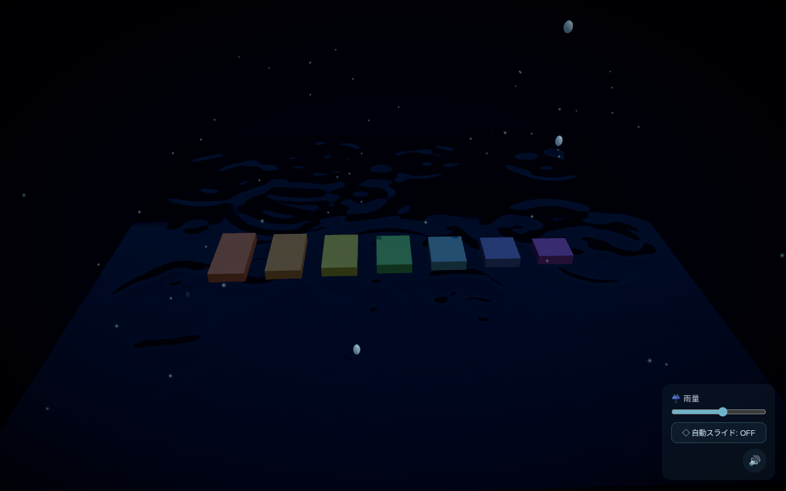

# ripple garden

放置系3Dアンビエント。夜の水面に雫がポタポタと落ち、波紋が広がる。水面に並べた鉄琴バーに雫が当たると、ペンタトニックの優しい音が鳴り、当たった場所が光る。操作は不要——眺めているだけで、毎回ちがう情景と音楽が生まれるジェネラティブ・ミュージック箱庭。



## 起動方法

```bash
npm install
npm run dev      # または: make run
```

`make help` で全タスク（run / build / preview / smoke / typecheck / clean）を表示。

ブラウザが開いたら、最初に一度クリックして音を有効にする（ブラウザの自動再生制限のため）。映像はクリック前から自動で動く。右下のボタンでミュート切り替え。

その他のスクリプト：

```bash
npm run build      # 型チェック + 本番ビルド
npm run typecheck  # 型チェックのみ
npm run preview    # ビルド結果のプレビュー
npm run smoke      # ヘッドレス Chromium で WebGL/シェーダの実行時エラーを検査
```

## 技術スタック

- Vite + React + TypeScript
- React Three Fiber (`@react-three/fiber`) + `@react-three/drei`
- `@react-three/postprocessing`（Bloom・色調補正・Vignette）
- Tone.js（音、初回クリック時に動的読み込み）

## できること

- **水面リップルシミュレーション**：GPU 上の波動方程式（高さ場 FBO の ping-pong）で水面そのものが波打つ。雫の着水点に波が立ち、淵で静かに減衰する。
- **生成され続ける雫**：上空のランダムな位置から、ゆらぎのある間隔で発光する雫が落ち続ける（放置で自動生成）。
- **マリンバの鉄琴バー**：横一列に並べた 7 本のバーにペンタトニック音階を割り当て。雫が当たると、その位置に応じて左右へ定位した温かい音が鳴り、バーが発光する。
- **アンビエントな音響**：マリンバの単音の下に、極低速で揺れるパッドのドローン。Reverb→EQ→Compressor→Limiter のマスターチェーンで整音。タブ非表示で自動停止・復帰。
- **夜の情景**：月明かりの映り込み、霧の粒子、緩やかな自動回転カメラ、フォグと Bloom と色調補正で落ち着いた雰囲気に。

## 構成

```
src/
  config.ts              シーン全体の調整パラメータ（水面・バー・波）
  audio/synth.ts         Tone.js の音響エンジン（遅延読み込み）
  water/
    waterField.ts        シム状態の共有オブジェクト
    WaterSim.tsx         GPU 波動方程式（ping-pong FBO）
    WaterPlane.tsx       高さ場から変位・法線を作る水面マテリアル
  state/settings.ts      実行時設定（雨量・自動スライド）
  scene/
    Scene.tsx            Canvas・カメラ・ライト・環境・月・後処理
    Effects.tsx          Bloom / 色調補正 / Vignette
    RainSystem.tsx       雫生成・着地判定・水面への波注入・発音の統括
    Drop.tsx             1 滴の落下（ガラス質の水玉）
    Splash.tsx           バー命中時の飛沫
    XylophoneBar.tsx     鉄琴バー（発光）
  ui/
    StartOverlay.tsx     音解禁のための初回クリック
    Controls.tsx         雨量スライダー・自動スライド・ミュート
```

波紋は手描きのリングではなく、水面シミュレーション（高さ場の波動方程式）が
水面そのものを波立たせることで表現している。

## 既知の制約 / 今後

- 水面は高さ場ベースの簡易シミュレーションで、屈折・本格的なコースティクスは未実装。
- オブジェクトはコードで固定配置（設置 UI・複数種類・成長要素は未実装）。
